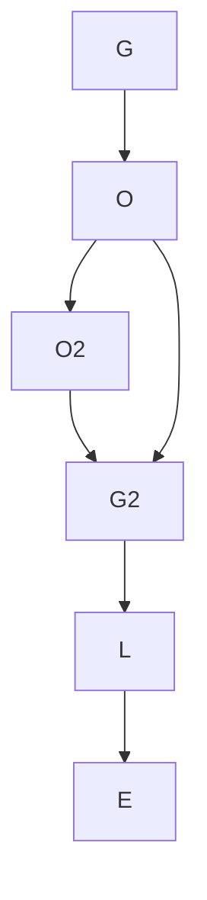

# Diff

Given [g,o,o,g,l,e] and [g,o,g,l,e] expected result

```diff
g
o
- o
g
l
e
```



```diff
A|C
B|B
C|A
A|B
B|A
B|C
A
```

```marmaid
graph TD;
    C+1-->B;
    A-->B;
    B-->A;
    A-->B2;
    B2-->A2;
    A2-->C;
    B-->C;
    C-->A2;
    A2-->B2;
    B2-->B3;
    B3-->A3;
```
